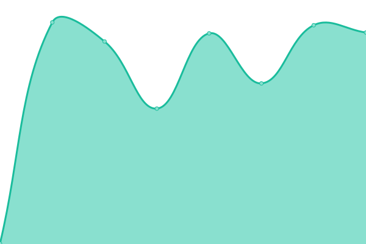
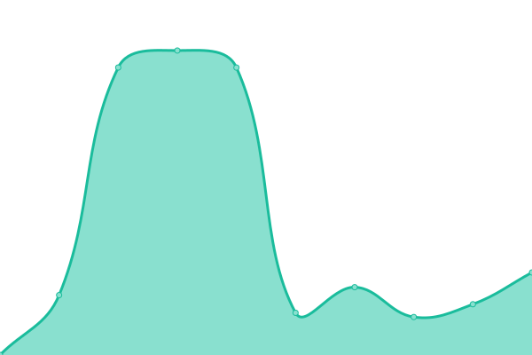
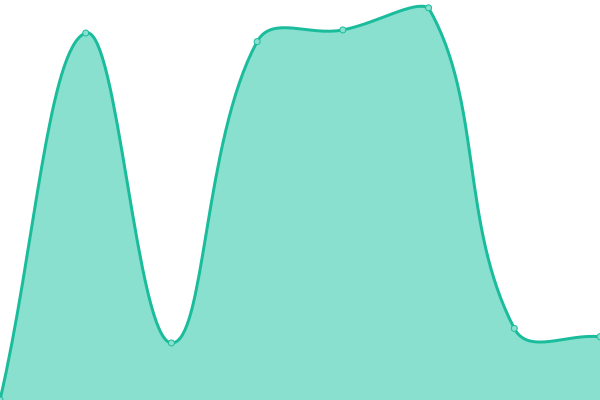

# [📈 Live Status](https://doc-uptime.pcloud.dev): <!--live status--> **🟩 All systems operational**

This repository contains the open-source uptime monitor and status page for [PCloud](https://doc-uptime.pcloud.dev), powered by [Upptime](https://github.com/upptime/upptime).

With [Upptime](https://upptime.js.org), you can get your own unlimited and free uptime monitor and status page, powered entirely by a GitHub repository. We use [Issues](https://github.com/HEIGE-PCloud/doc-uptime/issues) as incident reports, [Actions](https://github.com/HEIGE-PCloud/doc-uptime/actions) as uptime monitors, and [Pages](https://doc-uptime.pcloud.dev) for the status page.

<!--start: status pages-->
<!-- This summary is generated by Upptime (https://github.com/upptime/upptime) -->
<!-- Do not edit this manually, your changes will be overwritten -->
<!-- prettier-ignore -->
| URL | Status | History | Response Time | Uptime |
| --- | ------ | ------- | ------------- | ------ |
|  [Scientia](https://scientia.doc.ic.ac.uk/api/auth/login) | 🟩 Up | [scientia.yml](https://github.com/HEIGE-PCloud/doc-uptime/commits/HEAD/history/scientia.yml) | 

 5322ms
     
 | 

<a href="https://doc-uptime.pcloud.dev/history/scientia">100.00%</a>
    

|  [Cate](https://cate.doc.ic.ac.uk) | 🟩 Up | [cate.yml](https://github.com/HEIGE-PCloud/doc-uptime/commits/HEAD/history/cate.yml) | 

 1842ms
     
 | 

<a href="https://doc-uptime.pcloud.dev/history/cate">100.00%</a>
    

|  [GitLab](https://gitlab.doc.ic.ac.uk) | 🟩 Up | [git-lab.yml](https://github.com/HEIGE-PCloud/doc-uptime/commits/HEAD/history/git-lab.yml) | 

 3368ms
     
 | 

<a href="https://doc-uptime.pcloud.dev/history/git-lab">99.93%</a>
    

|  [Emarking](https://emarking.doc.ic.ac.uk/) | 🟩 Up | [emarking.yml](https://github.com/HEIGE-PCloud/doc-uptime/commits/HEAD/history/emarking.yml) | 

 1515ms
     
 | 

<a href="https://doc-uptime.pcloud.dev/history/emarking">100.00%</a>
    

<!--end: status pages-->

[**Visit our status website →**](https://doc-uptime.pcloud.dev)

## 📄 License

- Powered by: [Upptime](https://github.com/upptime/upptime)
- Code: [MIT](./LICENSE) © [PCloud](https://doc-uptime.pcloud.dev)
- Data in the `./history` directory: [Open Database License](https://opendatacommons.org/licenses/odbl/1-0/)
